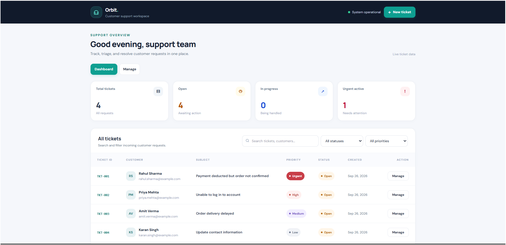
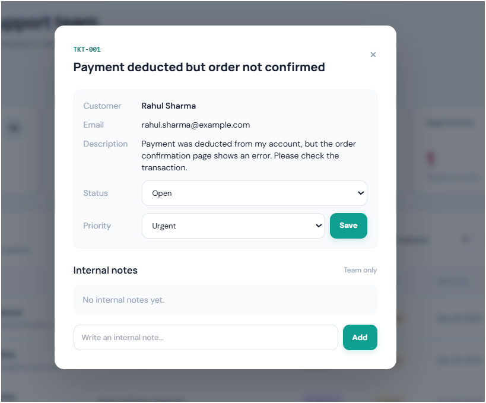
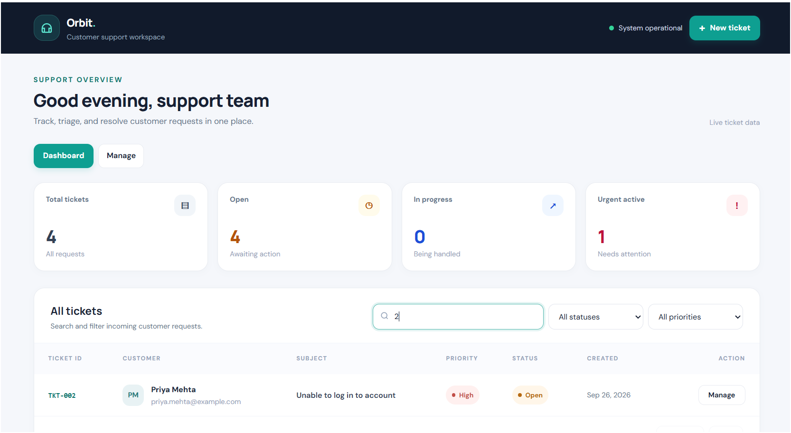
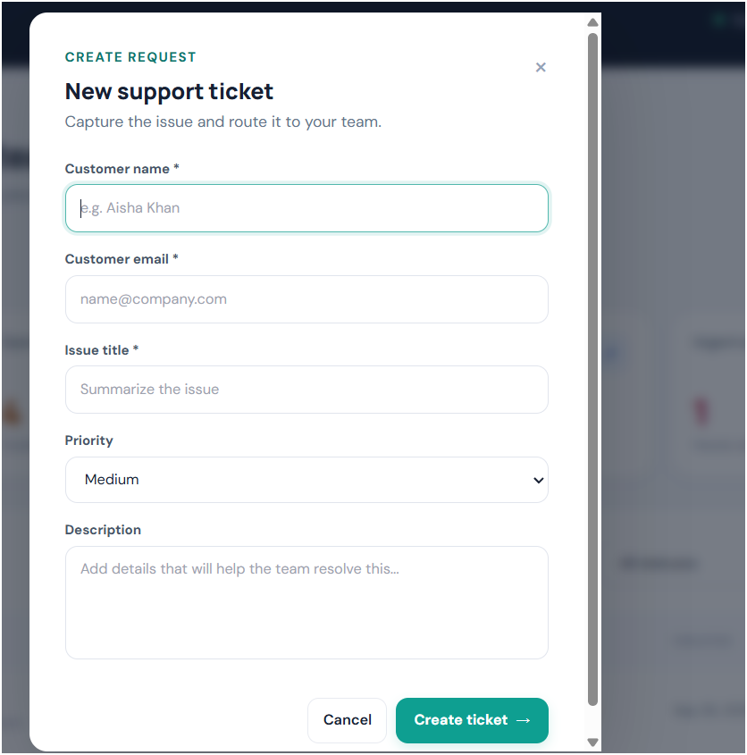
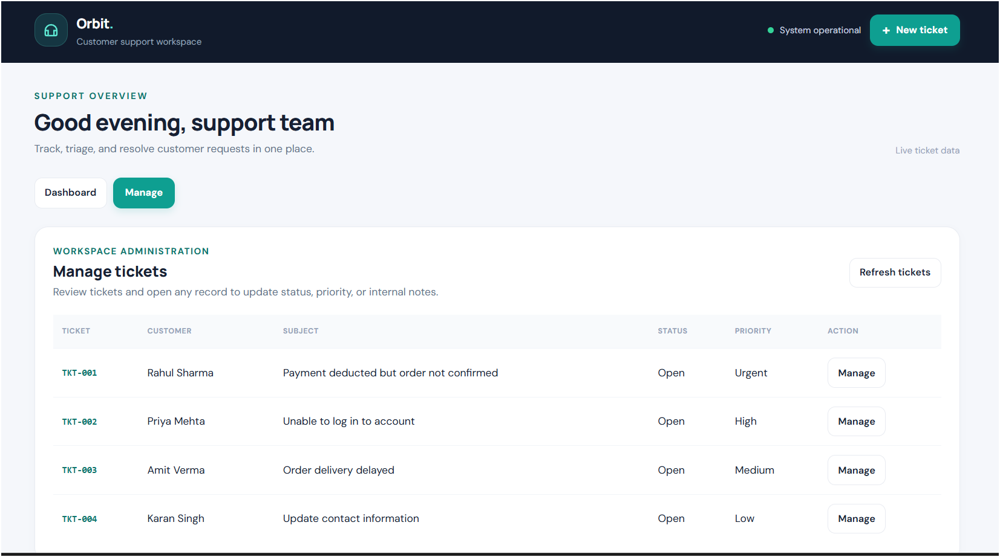

# Orbit Support Desk

A responsive, full-stack customer support ticket CRM built for the DataStraw assessment.

**Live Demo:** [https://orbit-support-desk.onrender.com/](https://orbit-support-desk.onrender.com/)

Orbit Support Desk includes ticket creation, searchable and filterable queues, ticket details, status and priority updates, internal notes, live queue metrics, and pagination.

## Screenshots

### Dashboard


### Ticket Details and Internal Notes


### Search and Filters


### Create New Ticket


### Manage Tickets


## Stack

- Node.js + Express 5 REST API
- SQLite with `better-sqlite3`
- HTML, vanilla JavaScript, Tailwind CSS CDN, and custom responsive CSS
- Jest + Supertest API tests

## Features

- Create support tickets with customer name, email, title, description, and priority.
- Browse tickets, sorted by priority (Urgent, High, Medium, Low) and then newest first.
- Search by ticket ID, customer name, email, or subject.
- Filter by status and priority, with server-side pagination.
- Open ticket details, update status and priority, and append internal notes.
- Dashboard counters for total, open, in-progress, and urgent active tickets.
- Manage workspace for ticket operations, without a People or Team directory.
- Responsive mobile layout, keyboard-accessible ticket rows, Escape/backdrop modal close, form validation, and success/error feedback.

## Run Locally

Use Node.js 20 or newer.

```bash
npm install
cp .env.example .env
# Windows PowerShell:
Copy-Item .env.example .env
npm start
```

Open [http://localhost:3000](http://localhost:3000).

The SQLite database is initialized automatically on first start. Set `DB_PATH` to choose a different database file. Set `PORT` if your host requires a specific port; the app uses the platform-provided `PORT` automatically.

## Tests

```bash
npm test -- --runInBand
```

The Jest/Supertest suite exercises ticket creation and validation, listing, search, filters, pagination headers, detail retrieval, updates, notes, and stats. Tests set `DB_PATH=:memory:` to avoid modifying the local database.

## REST API

| Method | Endpoint | Purpose |
|---|---|---|
| `POST` | `/api/tickets` | Create a ticket. Required JSON: `customer_name`, `customer_email`, `subject`; optional: `description`, `priority`. |
| `GET` | `/api/tickets?search=&status=&priority=&page=&limit=` | Search, filter, and paginate tickets. Returns a JSON array and `X-Total-Count`, `X-Page`, `X-Total-Pages` headers. |
| `GET` | `/api/tickets/:ticket_id` | Get ticket details and notes. |
| `PUT` | `/api/tickets/:ticket_id` | Update `status` and/or `priority`, and/or add a note using `notes`. |
| `GET` | `/api/stats` | Return ticket counts by status and urgent non-closed count. |

Allowed statuses: `Open`, `In Progress`, `Closed`. Allowed priorities: `Low`, `Medium`, `High`, `Urgent`.

## Deployment

The application is deployed on Render: [Open the live app](https://orbit-support-desk.onrender.com/).

For a Render Web Service, use the repository root with:

- **Build command:** `npm install`
- **Start command:** `npm start`
- **Root directory:** leave blank when the app files are at the repository root

The frontend is served by Express, so no separate frontend deployment or build is needed.

**SQLite persistence warning:** Free or ephemeral hosting filesystems can reset on redeploy or restart. SQLite is sufficient for a demo, but for persistent hosted data, attach a persistent disk/volume and set `DB_PATH` to a file path on that mounted volume, or migrate to a managed database. Confirm the host's current free-tier and persistent-volume rules before deploying.

## Architecture and Scope

The schema intentionally uses two tables: `tickets` and `notes`. Authentication, agent assignment, email notifications, and SLA automation are not included in this MVP, consistent with the assignment's instruction to keep authentication basic or omit it.

## AI/Tool Use

AI assistance was used to refine the interface and improve client-side error handling and validation. The API, schema, request/response behavior, and UI code should be reviewed and understood by the candidate before the walkthrough.

## Manage Workspace

The Manage workspace provides a ticket operations table. Open a ticket to edit its status, priority, and internal notes. The application does not include a People directory, team roster, or user-access administration.
